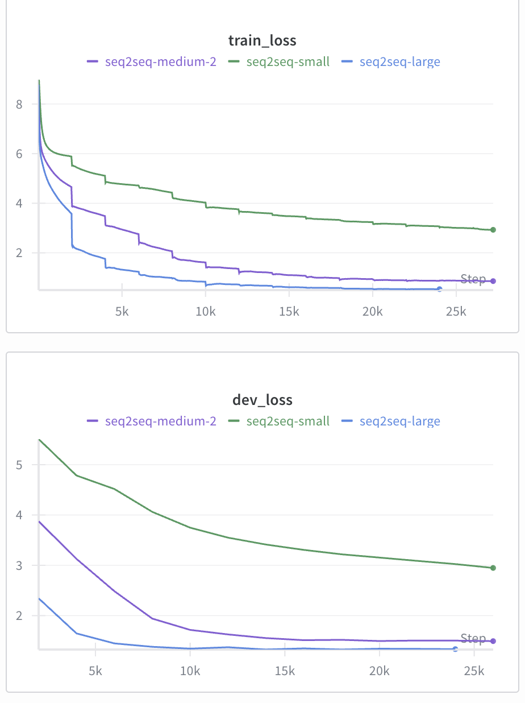

a.)

| Model              | Embedding Size | Hidden Size | Dropout | BLEU Score |
|--------------------|----------------|-------------|---------|------------|
| Seq-2-Seq Small    | 16             | 16          | 0.2     | 7.03       |
| Seq-2-Seq Medium   | 64             | 64          | 0.2     | 48.57      |
| Seq-2-Seq Large    | 128            | 128         | 0.2     | 52.608     |

b.)

c.)

As demonstrated by the Bleu scores and analyzing the given translations for each of the ablations of the model, the seq-2-seq architecture for the downstream task of French translation tends to get better as you increase embedding and hidden state size. This makes sense, as translation requires complex representations and transformations of data. As you increase the size of the states, more complicated representations and correlations can be discovered and modeled. One particular interesting discovery is that the Bleu score seems to taper off as you increase past a certain size. This demonstrates that after you give enough space to learn complex representations, further size gives diminishing results.
